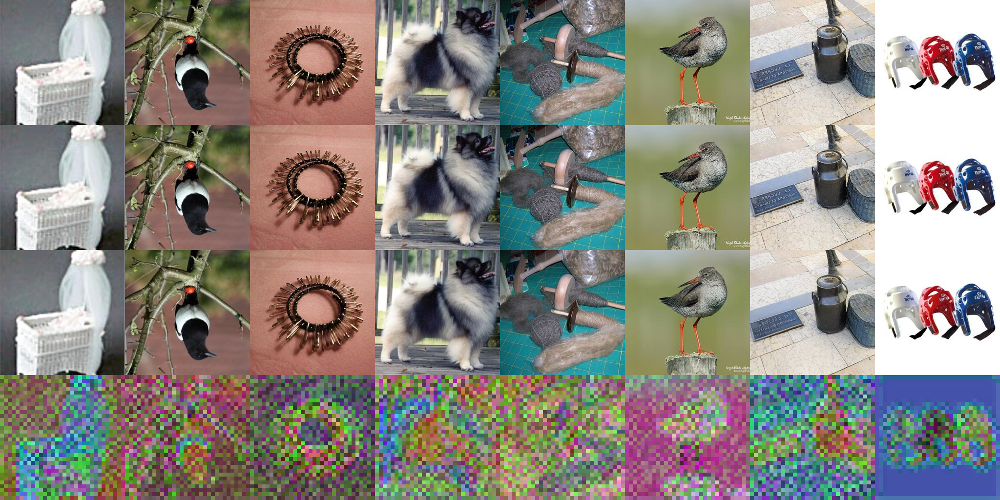
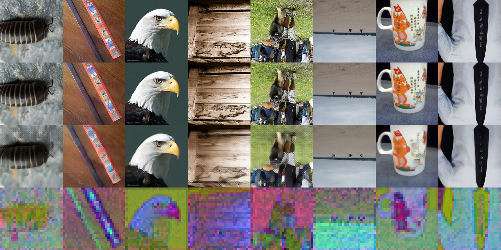

# [WIP] HakuLatent

A comprehensive codebase for training and finetuning Image <> Latent models.

## TODOs

- [X] Trainer for VAE or VQ-VAE or direct AE
  - [X] Basic Trainer
  - [ ] Decoder-only finetuning
  - [ ] PEFT
- [X] Equivariance Regularization [EQ-VAE](https://arxiv.org/abs/2502.09509)
  - [X] Rotate
  - [X] Scale down
  - [X] Scale up + crop
  - [X] crop
  - [X] random affine
  - [X] blending
- [X] Adversarial Loss
  - [ ] Investigate better discriminator setup
- [ ] Latent Regularization
  - [ ] Discrete VAE
  - [X] Kepler Codebook Regularization Loss
- [ ] Models
  - [ ] MAE for latent
  - [ ] windowed/natten attention for commonly used VAE setup

### EQ-VAE

[KBlueLeaf/EQ-SDXL-VAE · Hugging Face](https://huggingface.co/KBlueLeaf/EQ-SDXL-VAE)

Quick PoC run (significant quality degrad but also significant smoother latent):

| Before EQ-VAE                                  | After EQ-VAE                                   |
| ---------------------------------------------- | ---------------------------------------------- |
|  |  |

The 1~4 row are: original image, transformed image, decoded image from transformed latent, transformed latent

## Cite

```bibtex
@misc{kohakublueleaf_hakulatent,
    author       = {Shih-Ying Yeh (KohakuBlueLeaf)},
    title        = {HakuLatent: A comprehensive codebase for training and finetuning Image <> Latent models},
    year         = {2024},
    publisher    = {GitHub},
    journal      = {GitHub repository},
    url          = {https://github.com/KohakuBlueleaf/HakuLatent},
    note         = {Python library for training and finetuning Variational Autoencoders and related latent models, implementing EQ-VAE and other techniques.}
}
```
